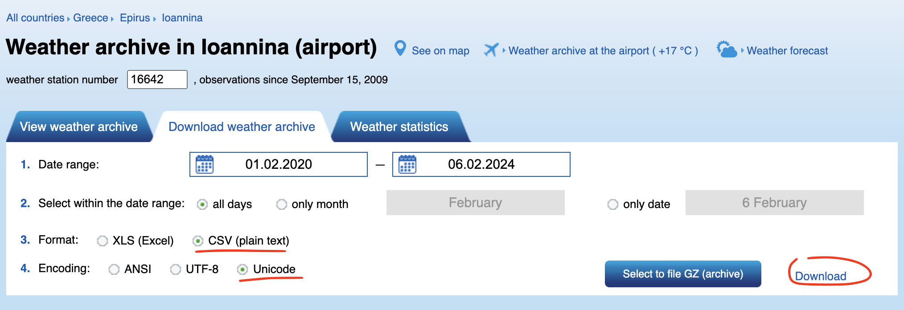

# Clematis World Weather API

[](https://github.com/grauds/clematis.weather.api/actions/workflows/docker-publish.yml)
[](https://github.com/grauds/clematis.weather.api/actions/workflows/docker-image.yml)

This API is for storing and retrieving weather measurements in scientific form made by professional meteorologists along with images with dates which ideally are taken outdoors near the location of the weather station chosen. Clients like UI applications or scientific scripts may use this info to present and analyse images with related weather information.

## API

Get image for the date (2021-04-12):
```
curl --location 'http://[host]:[port]/image?date=2021-04-12'
```
Get observations for the same date. Note, there are usually a series of observations for one day, for example, one every 3 or 4 hours:
```
curl --location 'http://[host]:[port]/observations/byDay?day=2021-04-12'
```

## Quick Start

Checkout the code
```
git clone https://github.com/grauds/clematis.weather.api.git
```
Set executable bit to gradlew
```
chmod +x gradlew
```
Run the build
```
./gradlew clean build
```
To pack the application into a Docker container run the Docker build
```
docker build -t clematis.weather.api .
```
When application can be built with Docker compose with the following environment variables:

* DATASOURCE_URL - A running instance of MySQL 8 database which has an empty scheme, for instance, `jdbc:mysql://192.168.1.2:3306/weather`
* DATASOURCE_USERNAME - User with permissions to connect to the database schema above and manage it.
* DATASOURCE_PASSWORD - Password for the user above, this should be preconfigured in the database.
* WEATHER_IMAGES_PATH - Path on the file system, local or on the server, absolute or relative to the applications working directory, where the images will be stored. This directory must be accessible to the user under which credentials the application is run.

```
docker compose build 
--build-arg SPRING_DATASOURCE_MYSQL_URL='$SPRING_DATASOURCE_MYSQL_URL'
--build-arg SPRING_DATASOURCE_MYSQL_USERNAME='$SPRING_DATASOURCE_MYSQL_USERNAME'
--build-arg SPRING_DATASOURCE_MYSQL_PASSWORD='$SPRING_DATASOURCE_MYSQL_PASSWORD'
--build-arg WEATHER_IMAGES_PATH='$WEATHER_IMAGES_PATH'
```
The suggested Docker compose configuration can be something like below:

```
  services:
    clematis-weather-api:
      container_name: clematis-weather-api
      image: clematis.weather.api:latest
      networks:
        - clematis_wth
      ports:
        - "18087:8080"
        - "15089:5000"
        - "15090:5001"
      env_file:
        - .env
      volumes:
        - /home/clematis/weather/logs:/var/log/clematis
        - /home/clematis/weather/images:/home/clematis/weather/images
      restart: unless-stopped

  networks:
    clematis_wth:
      driver: bridge
```

Environment variables ($JAVA_OPTS) must be specified as well if the application is run without a docker container:
```
java $JAVA_OPTS -Dspring.profiles.active=$ENV_NAME -jar app.jar
```

### Default Data
The weather observations data included into the repository is taken by the weather station Moscow, Russia, WMO_ID=27612. These files are available at http://rp5.ru/archive.php?wmo_id=27612&lang=en, thanks to 'Reliable Prognosis', rp5.ru, © Raspisaniye Pogodi Ltd., 2004-2024. The set of images is not available publicly at the moment. 

### Custom Data Retrieval

To get another set of data:

1. Open the countries selector https://rp5.ru/Weather_in_the_world, choose the desired location, for instance Greece, Epirus, Ioannina: https://rp5.ru/Weather_in_Ioannina. 
2. Click on weather archive link next to the location name: https://rp5.ru/Weather_archive_in_Ioannina_(airport)
3. Select date range, format CVS, unicode encoding and click 'Download'. 



### Importing Custom Data

There are two options to import the data from the previous step and both include some amount of coding. There will be a command line tool for end users soon.

#### Using Unit Tests

A Groovy Class [WeatherParser](https://github.com/grauds/clematis.weather.api/blob/main/tools/parser/src/main/groovy/jworkspace/weather/parser/WeatherParser.groovy) can parse the file provided, to use it one should be the following:
```
List<Observation> result = new WeatherParser(true, 
        [path to file relative to WeatherParser.class]).read()
```
Then the list of observations can be put to database, where session is <code>org.hibernate.Session</code>:
```
for (Observation observation : result) {
    Observation existing = session.find(Observation.class, observation.getKey();
    if (existing == null) {
        session.saveOrUpdate(observation)
    }
}
```
Example can be found [here](https://github.com/grauds/clematis.weather.api/blob/main/tools/parser/src/test/groovy/jworkspace/weather/parser/WeatherImporterTest.groovy).

#### Letting application parse the data

Application does the same on the startup, so the custom file(s) can be put to resources folder, data importer modified to load that files and after the application is rebuilt and redeployed the data will be imported to the database.

